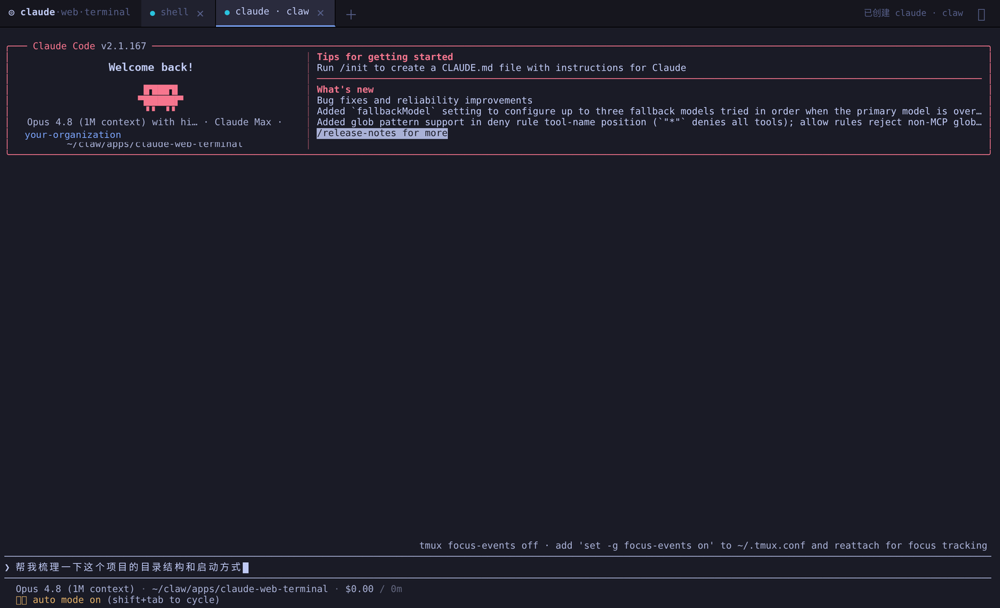
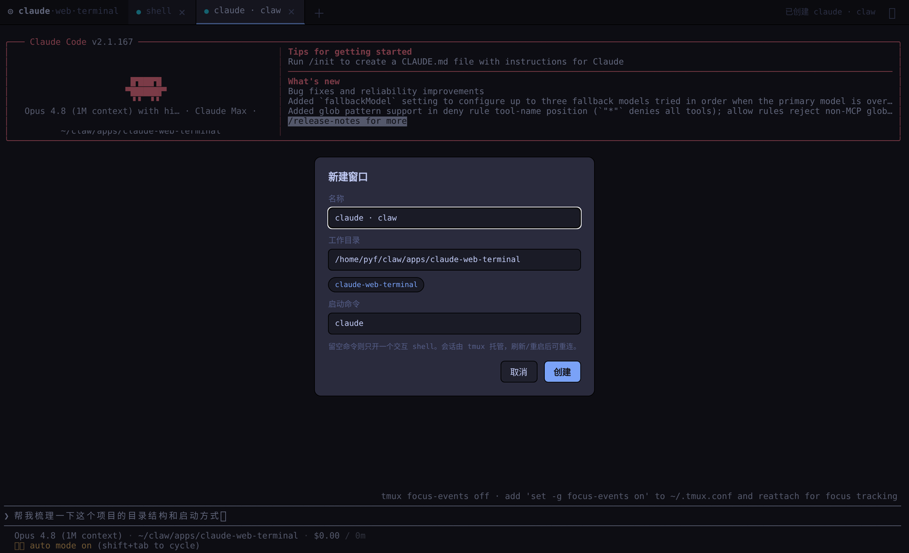
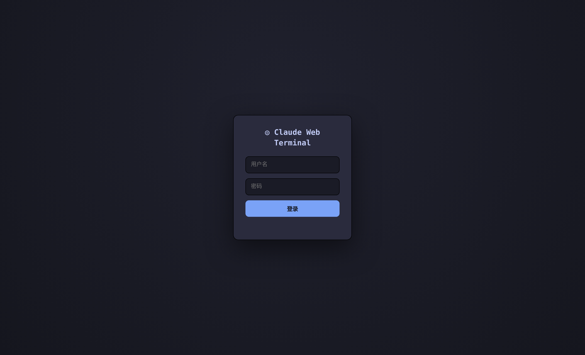
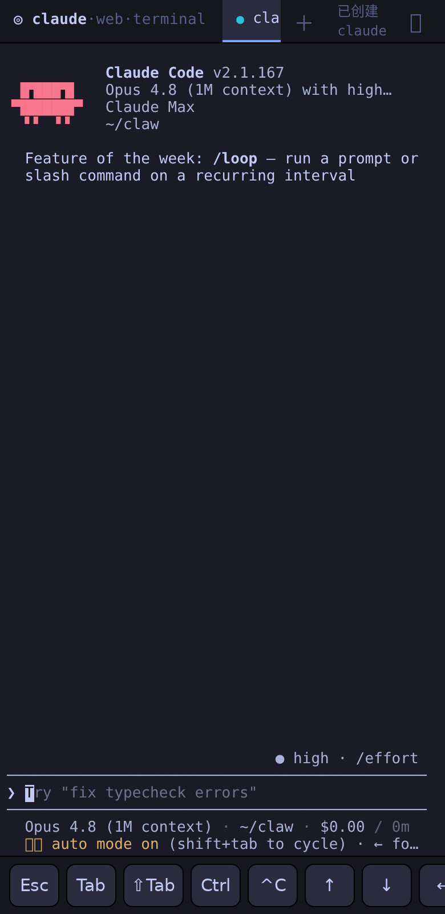

# Claude Web Terminal

Run **[Claude Code](https://claude.com/claude-code)** (or any shell command) from your browser.
A pseudo-terminal on the server is bridged over WebSocket to [xterm.js](https://xtermjs.org/),
so Claude's full interactive TUI — menus, arrow-key selection, streaming output — works exactly
as it does in a real terminal. Sessions are backed by **tmux**, so they survive browser
disconnects *and* server restarts: close the tab, reboot the box, come back later, and your
Claude session is right where you left it.



## Features

- 🖥️ **Real Claude Code in the browser** — every keystroke goes to the PTY's stdin; all
  stdout/stderr streams back live.
- 🪟 **Multiple windows** — tabbed sessions, create / close on demand, each its own process.
- ♻️ **Persistent & reconnectable** — tmux holds each session. Restart the server (or your
  laptop) and the terminals are still running; reopening replays the live screen.
- 📁 **Remembered working directories** — frequently used project dirs are saved and offered
  as one-click chips when you open a new window.
- 🔐 **Username / password login** — HMAC-signed cookie auth on both HTTP and WebSocket.
- 📱 **Mobile-friendly** — an on-screen key bar (Esc / Tab / ⇧Tab / Ctrl / ↑↓←→ / ⏎) sends the
  escape sequences Claude's TUI needs but phone soft keyboards lack. Ctrl is sticky: tap it, then a
  letter, for Ctrl-combos.
- 📦 **No CDN** — xterm is vendored locally (works behind restrictive networks).

| New window (with remembered dirs) | Login | On a phone (on-screen keys) |
|---|---|---|
|  |  |  |

## Architecture

```
browser (xterm.js) ──keystrokes──▶ WebSocket ──▶ node-pty ──▶ tmux attach ──▶ claude / shell
       ▲                                              │              │
       └──────────── PTY stdout/stderr ◀──────────────┘      (persists across
                                                              server restarts)
```

- **Backend** — Node + `node-pty` + `ws` + `express` (`server/`)
- **Frontend** — vanilla JS + `xterm.js` (`public/`)
- **Persistence** — each window is a tmux session `cwt_<id>`; the Node server attaches/detaches
  but never owns the session's lifetime. Metadata + remembered dirs live in
  `~/.config/claude-web-terminal/state.json`.

## Quick start

Requires **Node 18+** and **tmux**.

```bash
git clone https://github.com/pyf-labrary/claude-web-terminal
cd claude-web-terminal
npm install                       # compiles node-pty, vendors xterm

# localhost dev (defaults to admin/admin with a warning)
./run.sh

# with credentials
CWT_USER=me CWT_PASS=$(openssl rand -hex 12) PORT=7531 ./run.sh
```

Open `http://localhost:7531/`, log in, click **＋** to open a window (default command `claude`,
editable along with the working directory).

## Configuration

All via environment variables (see `.env.example`):

| Var | Default | Purpose |
|---|---|---|
| `PORT` | `7531` | listen port |
| `HOST` | `0.0.0.0` | bind address |
| `CWT_USER` | `admin` | login username |
| `CWT_PASS` | `admin` | login password — **set this** |
| `CWT_SECRET` | derived from `CWT_PASS` | cookie signing key |
| `CWT_TTL_DAYS` | `30` | cookie lifetime |
| `CWT_STATE_DIR` | `~/.config/claude-web-terminal` | state file location |

## REST API

| Method | Path | |
|---|---|---|
| `POST` | `/api/login` | `{user, pass}` → sets auth cookie |
| `POST` | `/api/logout` | clears cookie |
| `GET` | `/api/sessions` | list windows |
| `POST` | `/api/sessions` | create `{name?, cwd?, command?}` |
| `DELETE` | `/api/sessions/:id` | close window (kills tmux session) |
| `GET` | `/api/dirs` | remembered working directories |
| `WS` | `/ws?session=<id>` | bidirectional terminal stream |

## Deploy

`deploy/` ships a [systemd unit](deploy/claude-web-terminal.service) and an
[nginx reverse-proxy example](deploy/nginx.example.conf) (TLS termination + WebSocket upgrade +
`X-Forwarded-Proto` so the auth cookie gets the `Secure` flag).

```bash
# on the server
sudo cp -r . /opt/claude-web-terminal && cd /opt/claude-web-terminal && npm install
sudo cp deploy/claude-web-terminal.service /etc/systemd/system/
sudoedit /etc/systemd/system/claude-web-terminal.service   # set CWT_USER / CWT_PASS
sudo systemctl daemon-reload && sudo systemctl enable --now claude-web-terminal
```

Then point nginx at `127.0.0.1:7531`, issue a cert (HTTP-01 keeps DNS untouched), reload.

> **Security.** This grants whoever logs in a shell on your machine. Always set a strong
> `CWT_PASS`, terminate TLS in front of it, and prefer binding to `127.0.0.1` behind a reverse
> proxy (or a private network / VPN) rather than exposing the Node port directly.

> **Claude behind a firewall.** Claude Code needs to reach `api.anthropic.com`. If the server's
> network can't, set `HTTPS_PROXY` in the service environment — it propagates to every terminal.

## License

MIT
